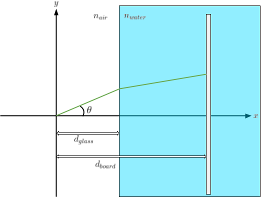
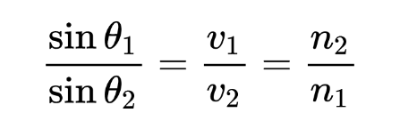
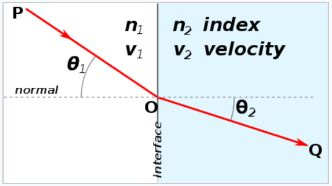

# TaskMarch2022
Underwater optical delousing offers many challenges.
We would like to introduce you to one of them.

As we all know from our high school physics lecture, when light rays (e.g laser) moves from one medium to another, the ray will slightly bend (refraction).
When trying to hit a sealouse this has to be included in the calculations.
We would like you to help us solve this.
To simplify the task we'll stick to 2 dimensions.

## Laser system

The figure shows a simplified 2D version of an underwater laser system consisting of 3 parts: a laser with adjustable rotation, a very thin glass interface between air and water, and a board that can be moved along the x-axis.
For this task we will ignore the glass.

The parameters of the system are:
- d_glass:  0.04
- n_air: 1.0
- n_water: 1.33

### Useful info on refraction
Refraction can be described by the following equation.

More info on `https://en.wikipedia.org/wiki/Refraction`.

## Task
The task is split into two parts, forward projection and backward projection of the laser beam.
Implementations in C++, Python or Matlab are preferred.

### a) Forward projection
Given laser angles and x coordinates of the board, write an algorithm to find the y coordinates of the laser hit points on the board. Test data is provided in `a.csv`.

### b) Backward projection
Given (x, y) positions on the board, write an algorithm to find the best laser angles to hit the targets. Test data is provided in `b.csv`.

Good luck!
